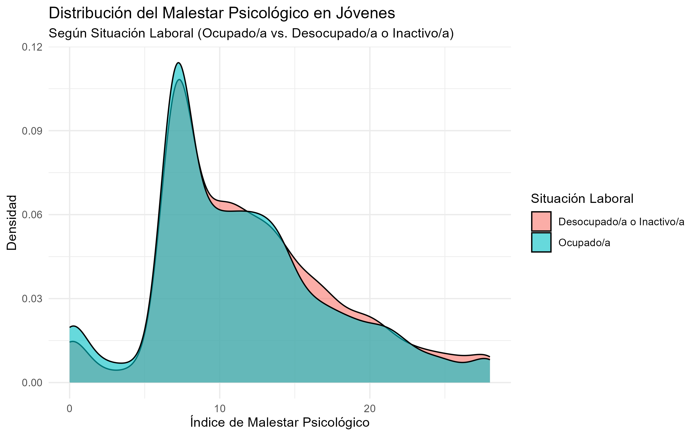

# Análisis de Salud Mental y Situación Laboral en Juventudes Chilenas (ENJUV 2022)

> **Ver el informe final publicado:** [Ver informe](https://94810.quarto.pub/analisis_enjuv/)

Este repositorio contiene el análisis completo para el trabajo final de la **Escuela de Datos 2025 de la Fundación SOL**. El objetivo es explorar la relación entre la situación laboral (ocupado/a vs. desocupado/a o inactivo/a) y dos dimensiones de la salud mental en jóvenes de Chile: el malestar psicológico y el acceso percibido a la atención.

---

### 🎯 Principales Hallazgos

*   **Mayor Malestar en Jóvenes Desocupados:** Se confirma que los jóvenes sin una ocupación laboral reportan niveles de malestar psicológico significativamente más altos.
*   **La Paradoja del Acceso:** Contrario a la intuición, los jóvenes desocupados o inactivos perciben un acceso significativamente *mayor* a la atención en salud mental que sus pares empleados, lo que sugiere que la precariedad laboral puede ser una barrera más grande que el desempleo.
*   **La Necesidad Genera Conciencia:** Se encontró una correlación positiva entre el malestar y el acceso, indicando que a mayor necesidad, los jóvenes tienden a informarse más sobre sus opciones de atención.

---

### 📊 Visualización Destacada

**Distribución del Malestar Psicológico**
*Se observa cómo en los niveles altos del índice (cola derecha), la densidad del grupo de desocupados (rojo) es consistentemente mayor.*

---

### 🛠️ Herramientas Utilizadas

*   **Lenguaje:** R
*   **Paquetes Principales:** `tidyverse` (para `dplyr` y `ggplot2`), `readxl`
*   **Documentación Reproducible:** Quarto

---

### 🚀 Cómo Ejecutar este Análisis

1.  Clonar este repositorio: `git clone https://github.com/pablo-araya-gajardo/Portfolio.git`
2.  Abrir el archivo `.qmd` en RStudio.
3.  Descargar la base de datos de la 10ma ENJUV y colocarla en la carpeta `/data/` (no incluida en el repositorio).
4.  Instalar las librerías necesarias.
5.  Renderizar el archivo `informe-final.qmd`.
